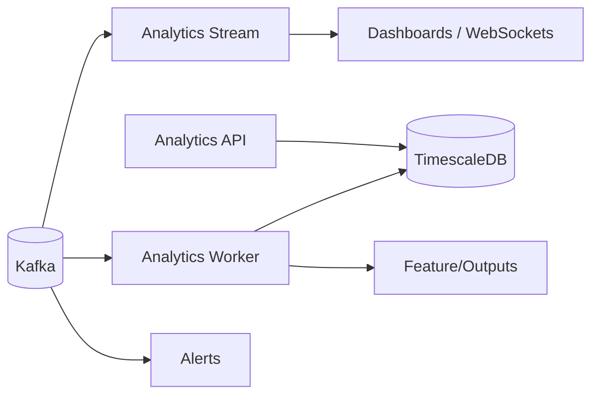

# Analytics Platform

Overview
- Purpose: Real-time and batch analytics over sensor and master data for dashboards, alerts, and reporting.
- Components (ports 7303–7306): Stream, Worker, API, Alerts

Components
- Analytics Stream (7303)
  - Node.js + KafkaJS + Redis + WebSockets
  - Consumes Kafka topics from sensor/master streams; provides real-time aggregations and feeds
  - Health: GET /health (service-specific); Metrics: if exposed
- Analytics Worker (7304)
  - Python + FastAPI + Kafka + TimescaleDB
  - Batch processing, feature engineering, ML inference, scheduled jobs
  - Health: GET /v1/health
- Analytics API (7305)
  - Python + FastAPI + TimescaleDB
  - Read APIs for dashboards: aggregations, reports, time-series queries
  - Health: GET /v1/health; Docs: /docs
- Analytics Alerts (7306)
  - Node.js + TypeScript + Kafka
  - Alert rules, alert processing, multi-channel notifications; health endpoint provided by service

Data Flow

Topics & Storage
- Kafka topics follow versioned names where applicable (e.g., `sensors.device.readings.v1`, `master.*.snapshot.v1`).
- Long-term time-series stored in TimescaleDB; cached aggregates in Redis where appropriate.

Observability
- Services expose health endpoints; some expose metrics for Prometheus.
- Use Grafana dashboards to visualize KPIs and system metrics.
