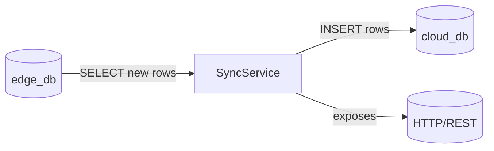

# Sync-Service

**Sync-Service** is a Node.js + TypeScript microservice responsible for synchronizing time-series sensor data from an **edge** PostgreSQL/TimescaleDB instance to a **cloud** PostgreSQL/TimescaleDB instance at configurable intervals.

---

## Table of Contents

1. [Features](#features)
2. [Architecture](#architecture)
3. [Getting Started](#getting-started)

   * [Prerequisites](#prerequisites)
   * [Installation](#installation)
   * [Configuration](#configuration)
   * [Running the Service](#running-the-service)
4. [Environment Variables](#environment-variables)
5. [API Reference](#api-reference)
6. [Sync Behavior](#sync-behavior)
7. [Development](#development)
8. [Docker](#docker)
9. [Logging & Monitoring](#logging--monitoring)
10. [Contributing](#contributing)
11. [License](#license)

---

## Features

* Periodic synchronization of new sensor readings from **edge\_db** to **cloud\_db**
* Configurable sync interval (minutes)
* **Express** health-check endpoint
* **TypeORM** for database access
* **node-cron** for scheduling
* **dotenv** for environment configuration

---

## Architecture



* **edgeDataSource**: connects to local TimescaleDB instance
* **cloudDataSource**: connects to remote (cloud) TimescaleDB instance
* **syncJob**: queries new rows since last sync and writes to cloud
* **Express server**: provides `/health` and `/sensors/latest` endpoints

---

## Getting Started

### Prerequisites

* Node.js v18+
* Yarn
* PostgreSQL / TimescaleDB instances for both edge and cloud
* Docker (optional, for containerized deployment)

### Installation

1. Clone the repo:

   ```bash
   git clone <repo-url> services/sync-service
   cd services/sync-service
   ```
2. Install dependencies:

   ```bash
   yarn install
   ```

### Configuration

Copy the example `.env.example` to `.env` and fill in your values:

```dotenv
# Edge database (TimescaleDB)
DB_HOST=localhost
DB_PORT=5432
DB_NAME=edge_db
DB_USER=postgres
DB_PASSWORD=password

# Cloud database (TimescaleDB)
CLOUD_DB_HOST=localhost
CLOUD_DB_PORT=5432
CLOUD_DB_NAME=cloud_db
CLOUD_DB_USER=postgres
CLOUD_DB_PASSWORD=password

# Service port & sync interval
SYNC_PORT=4104
SYNC_INTERVAL_MINUTES=5

# CORS settings
CORS_ALLOW_CREDENTIALS=true
CORS_ALLOWED_ORIGINS=*
CORS_ALLOW_METHODS=*
CORS_ALLOW_HEADERS=*
```

### Running the Service

* **Development** (with hot-reload):

  ```bash
  yarn dev
  ```

* **Production**:

  ```bash
  yarn build
  yarn start
  ```

---

## Environment Variables

| Variable                 | Description                                | Default   |
| ------------------------ | ------------------------------------------ | --------- |
| DB\_HOST                 | Host for edge PostgreSQL                   | localhost |
| DB\_PORT                 | Port for edge PostgreSQL                   | 5432      |
| DB\_NAME                 | Database name for edge                     | edge\_db  |
| DB\_USER                 | Username for edge DB                       | postgres  |
| DB\_PASSWORD             | Password for edge DB                       | password  |
| CLOUD\_DB\_HOST          | Host for cloud PostgreSQL                  | localhost |
| CLOUD\_DB\_PORT          | Port for cloud PostgreSQL                  | 5432      |
| CLOUD\_DB\_NAME          | Database name for cloud                    | cloud\_db |
| CLOUD\_DB\_USER          | Username for cloud DB                      | postgres  |
| CLOUD\_DB\_PASSWORD      | Password for cloud DB                      | password  |
| SYNC\_PORT               | HTTP port for sync-service                 | 4104      |
| SYNC\_INTERVAL\_MINUTES  | Interval (in minutes) between sync runs    | 1         |
| CORS\_ALLOW\_CREDENTIALS | Enable CORS credentials                    | true      |
| CORS\_ALLOWED\_ORIGINS   | Allowed origins for CORS (comma-separated) | \*        |
| CORS\_ALLOW\_METHODS     | Allowed HTTP methods for CORS              | \*        |
| CORS\_ALLOW\_HEADERS     | Allowed HTTP headers for CORS              | \*        |

---

## API Reference

### GET `/health`

* **Description**: Health-check endpoint
* **Response**:

  ```json
  { "status": "ok" }
  ```

### GET `/sensors/latest`

* **Description**: Returns up to 10 most recent sensor readings kept in memory
* **Response**:

  ```json
  {
    "data": [ /* array of SensorData */ ]
  }
  ```

---

## Sync Behavior

1. On startup, runs an initial sync (timestamp `> 1970-01-01`).
2. Every `SYNC_INTERVAL_MINUTES`, the cron job:

   * Queries `cloud_db` for the max `time` synced.
   * Fetches all `sensor_data` from `edge_db` where `time` > last.
   * Inserts new rows into `cloud_db` in chunks.

---

## Development

* Add entities or migrate schemas via TypeORM
* Extend routes in `/routes`
* Adjust scheduling in `/utils/syncJob.ts`

---

## Docker

Build the image and run:

```bash
# from project root
docker build -t sync-service ./services/sync-service

docker run -d \
  --name sync-service \
  --env-file ./services/sync-service/.env \
  -p ${SYNC_PORT}:4104 \
  sync-service
```

---

## Logging & Monitoring

* Logs printed to stdout via `console.log` / `console.error`
* Integrate with centralized logging (e.g., Fluentd, ELK) as needed

---

## Contributing

1. Fork and create a feature branch
2. Run tests (if any) and ensure linting passes
3. Submit a Pull Request with clear description

---

## License

MIT © Your Company
